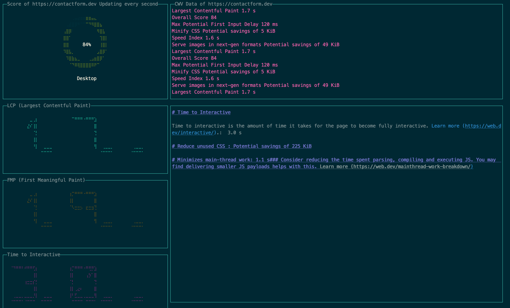

<h1 align="center">
  Web-Vitals-Shell
</h1>

<h4 align="center">
  Fancy terminal app for Core Web Vitals 💡
</h4>

    

## Usage

- Close the project!
- Run `npm i`
- Run `node index.js https://google.com(change this to any of your url)`

## Contributing

- Fork it!
- Create your feature branch: `git checkout -b my-new-feature`
- Commit your changes: `git commit -am 'Add some feature'`
- Push to the branch: `git push origin my-new-feature`
- Submit a pull request

## License

[MIT](LICENSE)

    

